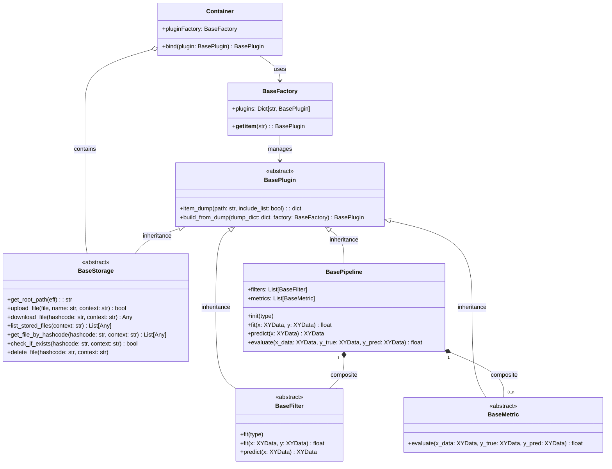
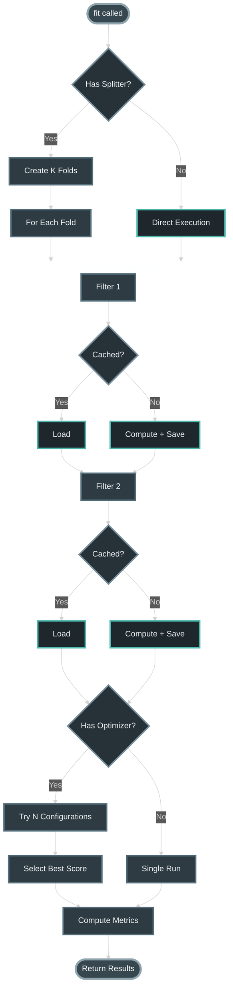
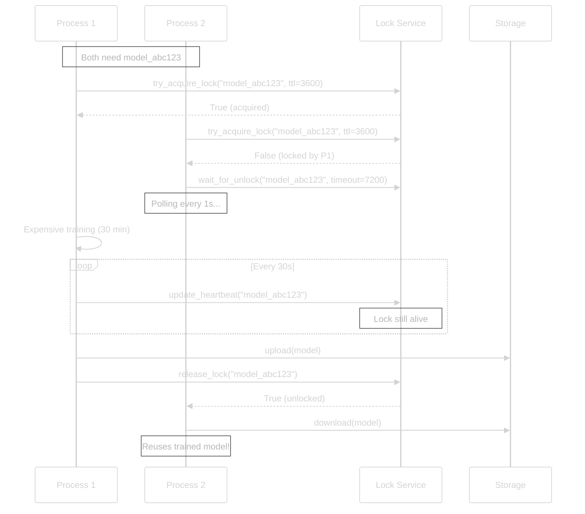

# Architecture

This guide explains LabChain's internal design, component relationships, and architectural patterns. For usage examples, see the [Quick Start](quick_start.md); for caching details, see the [Caching Guide](start_caching.md).

## Core Abstractions

LabChain is built on six base classes that define clear contracts:

| Component | Responsibility | Key Methods |
|-----------|---------------|-------------|
| `BaseFilter` | Transform data or train models | `fit(x, y)`, `predict(x)` |
| `BasePipeline` | Orchestrate filter execution | `fit()`, `predict()`, `evaluate()` |
| `XYData` | Content-addressable data container | `_hash`, `value` (lazy) |
| `BaseMetric` | Evaluate predictions | `calculate(y_true, y_pred)` |
| `BaseSplitter` | Cross-validation strategies | `split(x, y)` |
| `BaseOptimizer` | Hyperparameter search | `optimize(pipeline, scorer)` |

## Class Diagram

The following UML diagram shows the relationships between core classes and their main implementations:



**Key relationships:**

- **Plugin Inheritance**: All core components (Storage, Filter, Metric, Pipeline) inherit from `BasePlugin` to support uniform serialization and the Template Method pattern.

- **Dependency Injection**: The `Container` acts as a class-name-based dependency manager, allowing components to be registered and retrieved dynamically without direct coupling.

- **Composite Pattern**: `BasePipeline` allows composing multiple `BaseFilter` and `BaseMetric` instances into reusable hierarchical structures.

- **Abstract Factory**: `BaseFactory` enables the dynamic instantiation of plugins from textual identifiers, facilitating experiment reconstruction from JSON dumps.

- **Content-Addressable Storage**: Filters generate deterministic hashes based on configuration and inputs, which `BaseStorage` uses to store and retrieve intermediate results.

## Hash-Based Identity System

LabChain uses cryptographic hashing to create unique identities for filters and data, enabling automatic cache reuse.

### Filter Hash Formula

A filter's identity is determined by its **public attributes** (constructor parameters):

```python
filter_hash = SHA256(
    class_name +
    serialize(public_attributes)
)
```

**Example:**
```python
@Container.bind()
class MyFilter(BaseFilter):
    def __init__(self, threshold: float = 0.5):
        super().__init__(threshold=threshold)
        self.threshold = threshold  # Public → included in hash
        self._cache = {}            # Private → excluded from hash
```

Two instances with identical public attributes produce the **same hash**:
```python
filter1 = MyFilter(threshold=0.7)
filter2 = MyFilter(threshold=0.7)
assert filter1._m_hash == filter2._m_hash  # True

filter3 = MyFilter(threshold=0.9)
assert filter1._m_hash != filter3._m_hash  # Different hash
```

### Data Hash Formula

XYData containers hash both metadata and content:

```python
data_hash = SHA256(name + str(value))
```

**Implications:**

- Identical data → Same hash → Cache hit
- Modified data → Different hash → Cache miss (automatic invalidation)

### Cache Key Construction

Cache keys combine filter and data hashes:

```
FilterClassName/filter_hash/data_hash
```

**Example storage structure:**
```
cache/
├── StandardScalerPlugin/
│   ├── a3f5d8e1.../          # filter_hash (scale params)
│   │   ├── model             # Fitted scaler
│   │   ├── 7b2c1f...         # Scaled version of data 7b2c1f
│   │   └── 9e4a3d...         # Scaled version of data 9e4a3d
│   └── b7e2c9f4.../          # Different scale params
│       └── ...
└── KnnFilter/
    └── c1d8f3a2.../
        ├── model             # Trained KNN
        └── predictions_xyz   # Predictions for data xyz
```

## Pipeline Execution Flow

When you call `pipeline.fit(x, y)`:



### Optimization Loop

When an optimizer is attached, it explores the hyperparameter space:

```python
# Grid search: exhaustive
for config in all_configurations:
    score = pipeline.fit_with_config(config, x, y)
    if score > best_score:
        best_score = score
        best_config = config

# Bayesian: smart sampling
for trial in range(n_trials):
    config = suggest_next_config(previous_results)
    score = pipeline.fit_with_config(config, x, y)
    update_model(config, score)
```

## Dependency Injection via Container

The `Container` singleton manages component registration and retrieval.

### Registration

The `@Container.bind()` decorator registers classes in type-specific factories:

```python
from labchain import Container, BaseFilter

@Container.bind()
class MyFilter(BaseFilter):
    # Automatically registered in Container.ff (Filter Factory)
    pass

@Container.bind()
class MyMetric(BaseMetric):
    # Automatically registered in Container.mf (Metric Factory)
    pass
```

### Factory Mapping

| Base Class | Factory | Purpose |
|------------|---------|---------|
| `BaseFilter` | `Container.ff` | Filters and models |
| `BasePipeline` | `Container.pf` | Pipeline types |
| `BaseMetric` | `Container.mf` | Evaluation metrics |
| `BaseOptimizer` | `Container.of` | Optimization strategies |
| `BaseSplitter` | `Container.sf` | Data splitting |

### Runtime Retrieval

Components are retrieved by string name:

```python
# Get class from factory
FilterClass = Container.ff["MyFilter"]

# Instantiate with parameters
instance = FilterClass(param1=value1)

# Or use the PluginFactory
from labchain.container import PluginFactory
instance = PluginFactory.build(
    "MyFilter",
    {"param1": value1},
    Container.ff
)
```

## Serialization Architecture

Pipelines serialize to pure JSON for reproducibility and version control.

### Serialization Process

```python
pipeline = F3Pipeline(
    filters=[StandardScalerPlugin(), KnnFilter(n_neighbors=5)],
    metrics=[F1()]
)

config = pipeline.item_dump()
```

**Result:**
```json
{
  "clazz": "F3Pipeline",
  "params": {
    "filters": [
      {
        "clazz": "StandardScalerPlugin",
        "params": {}
      },
      {
        "clazz": "KnnFilter",
        "params": {"n_neighbors": 5}
      }
    ],
    "metrics": [
      {
        "clazz": "F1",
        "params": {"average": "weighted"}
      }
    ]
  }
}
```

### Deserialization Process

```python
from labchain.base import BasePlugin

restored_pipeline = BasePlugin.build_from_dump(
    config_dict,
    Container.pif  # Plugin Instance Factory
)

# Identical behavior to original
predictions = restored_pipeline.predict(x_test)
```

**Use cases:**
- Store experiment configurations in git
- Share exact setups with collaborators
- Reproduce published results
- Deploy to production environments

## Distributed Locking Protocol

For race-free distributed caching, `LockingLocalStorage` and `LockingS3Storage` implement a lock protocol.

### Lock Acquisition Flow



### Lock Metadata

Locks store metadata for debugging and crash detection:

```json
{
  "owner": "worker-node-5.ec2.internal",
  "pid": 12345,
  "created_at": 1735562400.0,
  "ttl": 3600,
  "last_heartbeat": 1735562850.5,
  "heartbeat_interval": 30
}
```

### Crash Detection

If a process crashes:

1. Heartbeat stops updating
2. Other processes detect: `current_time - last_heartbeat > 3 * heartbeat_interval`
3. Lock is considered "dead" and can be stolen
4. New process acquires lock and retries computation

This prevents indefinite blocking if a worker dies mid-training.

## Pipeline Composition Patterns

### Sequential Composition (F3Pipeline)

Filters execute in order, each feeding into the next:

```python
pipeline = F3Pipeline(filters=[A, B, C])

# Execution: C(B(A(x)))
result = pipeline.predict(x)
```

### Parallel Composition (ParallelPipeline)

Filters execute independently, results are combined:

```python
from labchain import ParallelPipeline

parallel = ParallelPipeline(filters=[A, B, C])

# Execution: [A(x), B(x), C(x)] → concatenate
result = parallel.predict(x)
```

**Use case:** Independent feature extractors
```python
features = ParallelPipeline(filters=[
    TfidfFeatures(),
    SentimentScores(),
    NamedEntityCounts()
])
```

### Nested Composition

Pipelines can contain pipelines:

```python
preprocessing = F3Pipeline(filters=[Cleaner, Normalizer])
models = ParallelPipeline(filters=[KNN, SVM, RF])

ensemble = F3Pipeline(filters=[
    preprocessing,  # Pipeline as filter
    models,         # Parallel pipeline
    VotingAggregator()
])
```

## Design Principles

### Single Responsibility

Each class does one thing well:
- `BaseFilter`: Transform or predict
- `BasePipeline`: Orchestrate execution
- `BaseMetric`: Evaluate performance
- `BaseSplitter`: Split data
- `BaseOptimizer`: Search hyperparameters
- `BaseStorage`: Persist objects

### Open/Closed Principle

Open for extension (inherit base classes), closed for modification (don't change core):

```python
# ✅ Extend
@Container.bind()
class MyCustomFilter(BaseFilter):
    pass

# ❌ Don't modify BaseFilter itself
```

### Dependency Inversion

High-level modules (pipelines) depend on abstractions (base classes), not concrete implementations:

```python
# Pipeline accepts any BaseFilter, not specific classes
class F3Pipeline(BasePipeline):
    def __init__(self, filters: List[BaseFilter]):
        self.filters = filters  # Works with any BaseFilter
```

This allows swapping implementations without changing pipeline code.

## Performance Architecture

### Lazy Evaluation

`XYData.value` is computed only when accessed:

```python
x = XYData("data", "/path", expensive_computation)
# expensive_computation() NOT called yet

print(x._hash)  # Still not called (hash from name)

result = x.value  # NOW expensive_computation() is called
```

### Selective Caching

Cache only expensive operations:

```python
# ✅ Cache expensive
Cached(filter=BERTEmbeddings())  # Hours

# ❌ Don't cache cheap
StandardScalerPlugin()  # Milliseconds (not worth overhead)
```

### Memory-Efficient Storage

Large models stored once, predictions can be regenerated:

```python
Cached(
    filter=HugeModel(),
    cache_filter=True,   # Save 5GB model
    cache_data=False     # Don't save 10GB predictions
)
```

## Extension Points

To extend LabChain, inherit from base classes and register:

```python
from labchain import BaseFilter, BaseMetric, Container

@Container.bind()
class DomainSpecificFilter(BaseFilter):
    def fit(self, x, y): ...
    def predict(self, x): ...

@Container.bind()
class CustomMetric(BaseMetric):
    direction = "maximize"
    def calculate(self, y_true, y_pred): ...
```

No changes to core required. The container system discovers and registers new components automatically.

## Related Documentation

- **[Quick Start](quick_start.md)** — Learn by building pipelines
- **[Caching Guide](start_caching.md)** — Master distributed caching
- **[API Reference](api/index.md)** — Complete class documentation
- **[Examples](examples/index.md)** — Real-world use cases
