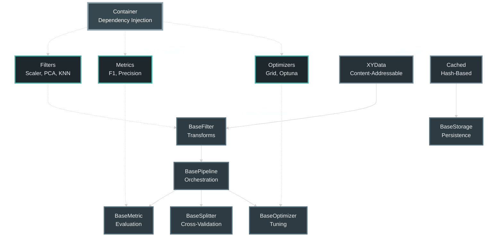

<style>
/* Hero section que se adapta a dark/light mode */

.hero {
    background: linear-gradient(
        135deg,
        var(--md-default-bg-color) 0%,
        var(--md-code-bg-color) 100%
    );
    color: var(--md-default-fg-color);
    padding: 2.5rem 2rem;
    border-radius: 8px;
    margin-bottom: 3rem;
    border: 1px solid var(--md-default-fg-color--lightest);
}

.hero h1 {
    font-size: 2.2rem;
    margin-bottom: 1rem;
    font-weight: 700;
    color: var(--md-default-fg-color);
}

.hero .tagline {
    font-size: 1.05rem;
    color: var(--md-default-fg-color--light);
    line-height: 1.6;
    max-width: 720px;
}


.stats {
    display: grid;
    grid-template-columns: repeat(auto-fit, minmax(200px, 1fr));
    gap: 1.5rem;
    margin: 2rem 0;
}

.stat-card {
    background: var(--md-default-bg-color, white);
    padding: 1.5rem;
    border-radius: 8px;
    text-align: center;
    box-shadow: 0 4px 6px rgba(0,0,0,0.1);
    border-left: 4px solid #667eea;
    border: 1px solid var(--md-default-fg-color--lightest, #e0e0e0);
}

.stat-card .number {
    font-size: 2rem;
    font-weight: 700;
    color: #667eea;
    display: block;
}

.stat-card .label {
    color: var(--md-default-fg-color--light, #666);
    font-size: 0.9rem;
    margin-top: 0.5rem;
}

.feature-grid {
    display: grid;
    grid-template-columns: repeat(auto-fit, minmax(280px, 1fr));
    gap: 1.5rem;
    margin: 2rem 0;
}

.feature-card {
    background: var(--md-code-bg-color, #f8f9fa);
    padding: 1.5rem;
    border-radius: 8px;
    border-left: 3px solid #667eea;
    border: 1px solid var(--md-default-fg-color--lightest, #e0e0e0);
}

.feature-card h3 {
    color: #667eea;
    margin-top: 0;
    font-size: 1.2rem;
}

.cta-buttons {
    display: flex;
    gap: 1rem;
    flex-wrap: wrap;
    margin-top: 2rem;
}

.btn {
    padding: 0.75rem 1.5rem;
    border-radius: 6px;
    text-decoration: none !important;
    font-weight: 600;
    display: inline-block;
    transition: all 0.3s;
}

.btn-primary {
    background: white;
    color: #667eea !important;
}

.btn-primary:hover {
    transform: translateY(-2px);
    box-shadow: 0 4px 12px rgba(0,0,0,0.15);
    color: #667eea !important;
}

.btn-secondary {
    background: rgba(255,255,255,0.2);
    color: white !important;
    border: 2px solid white;
}

.btn-secondary:hover {
    background: white;
    color: #667eea !important;
}
</style>

<div class="hero">
    <h1>LabChain</h1>
    <div class="tagline">
        Stop wasting computation. Start caching results.<br/>
        Build reproducible ML experiments with automatic inter-team result reuse.
    </div>
    <div class="cta-buttons">
    <a href="quick_start/" class="md-button md-button--primary">
        Get started
    </a>
    <a href="https://github.com/manucouto1/LabChain"
        class="md-button">
        View on GitHub
    </a>
    </div>

</div>

<div class="stats">
    <div class="stat-card">
        <span class="number">12+ hrs</span>
        <span class="label">Computation saved per task in production</span>
    </div>
    <div class="stat-card">
        <span class="number">192%</span>
        <span class="label">Performance improvement in mental health detection</span>
    </div>
    <div class="stat-card">
        <span class="number">0 KB</span>
        <span class="label">Redundant data recomputation with smart caching</span>
    </div>
</div>

## The Problem

Python's flexibility accelerates research prototyping but frequently results in **unmaintainable code** and **duplicated computational effort**. When evaluating multiple classifiers on the same embeddings, researchers typically recompute those embeddings for each classifier—wasting hours of computation and CO₂ emissions.

Traditional workflow frameworks (scikit-learn, Kedro, Snakemake) don't solve the fundamental inefficiency: **identical transformations computed by different team members are never automatically reused**.

## The Solution

LabChain uses **hash-based caching** with **content-addressable storage** to automatically identify and reuse intermediate results. When your colleague applies different models to the same preprocessed data, LabChain detects existing results and eliminates redundant computation—**without manual coordination**.

```python
from labchain import F3Pipeline, XYData
from labchain.plugins.filters import Cached, StandardScalerPlugin, KnnFilter

# Wrap expensive operations with automatic caching
pipeline = F3Pipeline(
    filters=[
        Cached(
            filter=DeepLearningEmbeddings(),  # Computed once
            cache_data=True,
            cache_filter=True
        ),
        KnnFilter()  # Swap classifiers freely
    ]
)

# First run: computes and caches embeddings
pipeline.fit(x_train, y_train)

# Subsequent runs or other team members: instant cache hit
# Even with different classifiers!
```

<div class="feature-grid">
    <div class="feature-card">
        <h3>🔄 Automatic Caching</h3>
        Cryptographic hashing identifies identical computations. Share results across your team with zero configuration.
    </div>
    <div class="feature-card">
        <h3>📦 Executable Configs</h3>
        Pipelines serialize to JSON. Each dump is a complete, reproducible experiment.
    </div>
    <div class="feature-card">
        <h3>🎯 Built-in Optimization</h3>
        Grid search, Bayesian (Optuna), or Weights & Biases integration. Define search space once.
    </div>
    <div class="feature-card">
        <h3>✅ Cross-Validation</h3>
        K-Fold and Stratified K-Fold with automatic metric aggregation and std reporting.
    </div>
    <div class="feature-card">
        <h3>☁️ Cloud Storage</h3>
        Native S3 support. Share cached results across geographical locations.
    </div>
    <div class="feature-card">
        <h3>🧩 Modular Design</h3>
        Filters, metrics, optimizers—all pluggable. Extend by inheriting base classes.
    </div>
</div>

## Quick Start

Install via pip:

```bash
pip install labchain
```

Build your first pipeline:

```python
from labchain import F3Pipeline, XYData
from labchain.plugins.filters import StandardScalerPlugin, KnnFilter
from labchain.plugins.metrics import F1, Precision, Recall

pipeline = F3Pipeline(
    filters=[
        StandardScalerPlugin(),
        KnnFilter(n_neighbors=5)
    ],
    metrics=[F1(), Precision(), Recall()]
)

pipeline.fit(x_train, y_train)
predictions = pipeline.predict(x_test)
results = pipeline.evaluate(x_test, y_test, predictions)
# {'F1': 0.96, 'Precision': 0.97, 'Recall': 0.95}
```

Want optimization? Just add it:

```python
from labchain.plugins.optimizer import OptunaOptimizer

pipeline.optimizer(
    OptunaOptimizer(
        direction="maximize",
        n_trials=50,
        scorer=F1()
    )
)
```

Want cross-validation? Stack it:

```python
from labchain.plugins.splitter import KFoldSplitter

pipeline.splitter(
    KFoldSplitter(n_splits=5, shuffle=True)
)

# Now returns {'F1': 0.85, 'F1_std': 0.03, 'F1_scores': [...]}
```

## Architecture

LabChain follows a **pipeline-and-filter architecture** where filters are composable transformations with `fit()` and `predict()` methods:



**Key abstraction**: Each filter has a unique hash computed from its class name, public parameters, and input data hash. This forms a **provenance chain** that enables automatic cache hits when configurations match.

## Real-World Impact

A [published case study](https://github.com/manucouto1/Temporal-Word-Embeddings-for-Early-Detection) on mental health detection using temporal language analysis demonstrated:

- **12+ hours** of computation saved per task through caching
- **2.5–11 kg CO₂** emissions avoided (conservative estimates)
- **Up to 192% performance improvement** in some tasks compared to the original monolithic implementation

The performance gains emerged because **modular design exposed a critical preprocessing bug** that remained hidden in unstructured code. When embeddings were cached as an explicit filter, the bug became immediately visible during component validation.

## Why LabChain Over Alternatives?

| Feature | LabChain | scikit-learn | Kedro | Snakemake |
|---------|----------|--------------|-------|-----------|
| **Automatic inter-team caching** | ✅ Hash-based | ❌ None | ❌ Manual files | ❌ Timestamps |
| **Executable configuration** | ✅ JSON → code | ❌ Pickle only | ❌ YAML + code | ❌ Rules only |
| **State management** | ✅ Filter-internal | Pipeline objects | Catalog flow | File artifacts |
| **Cloud storage** | ✅ Native S3 | ❌ | Plugin | Limited |
| **Setup overhead** | Minimal | None | High | Medium |
| **Target use case** | Iterative research | Model building | Production ETL | Bioinformatics |

**LabChain's niche**: Collaborative research where multiple people explore variations on expensive preprocessing pipelines.

## Core Concepts

**BaseFilter** — Any data transformation. Implement `fit(x, y)` and `predict(x)`.

**BasePipeline** — Chains filters. Supports sequential, parallel, or MapReduce execution.

**BaseMetric** — Evaluation function. Knows if higher/lower is better for optimization.

**BaseStorage** — Persistence backend. Swap local/S3/custom without changing code.

**Container** — Dependency injection. Registers components via `@Container.bind()`.

**XYData** — Data wrapper with content-addressable hash for cache lookups.

## Extension Example

Creating a custom filter is straightforward:

```python
from labchain import BaseFilter, XYData, Container

@Container.bind()
class MyTransformer(BaseFilter):
    def __init__(self, scale: float = 1.0):
        super().__init__(scale=scale)
        self.scale = scale
        self._mean = None  # Private state

    def fit(self, x: XYData, y: XYData | None):
        self._mean = x.value.mean()

    def predict(self, x: XYData) -> XYData:
        transformed = (x.value - self._mean) * self.scale
        return XYData.mock(transformed)
```

**Key insight**: Public attributes (like `scale`) define the filter's identity and appear in the hash. Private attributes (like `_mean`) are internal state excluded from serialization.

## Production Readiness

LabChain is **actively maintained** and used daily in production research at [CiTIUS](https://citius.usc.es/).

**Stable components**: Core filters, pipelines, Container, caching, data splitting, WandB optimizer.

**Experimental components**: Sklearn/Optuna optimizers, distributed execution.

**Roadmap**:
- Graphical interfaces for non-programmers
- Federated execution across institutions
- Deep PyTorch integration (cacheable layer-wise pretraining)

## Learn More

- **[Quick Start Guide](quick_start/)** — Step-by-step tutorial
- **[Start Caching](start_caching/)** — Step-by-step tutorial
- **[Architecture Deep Dive](architecture/)** — Technical details
- **[Examples](examples/)** — Real-world use cases
- **[Best Practices](best_practices/)** — Production patterns
- **[API Reference](api/)** — Complete documentation

## Community

- **GitHub**: [manucouto1/LabChain](https://github.com/manucouto1/LabChain)
- **Documentation**: [manucouto1.github.io/LabChain](https://manucouto1.github.io/LabChain/)
- **Paper**: [SoftwareX submission](https://github.com/manucouto1/LabChain) (preprint)
- **Case Study**: [Mental health detection](https://github.com/manucouto1/Temporal-Word-Embeddings-for-Early-Detection)

LabChain is licensed under **AGPL-3.0**. Contributions welcome!

---

**Ready to stop recomputing?** Install `labchain` and start caching. [Get Started →](quick_start/)
